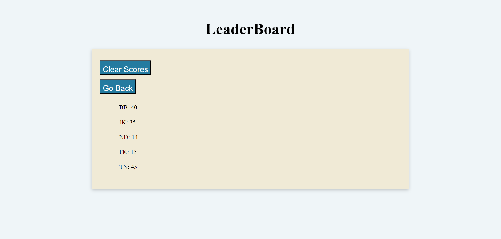

# 04 Web APIs: Code Quiz
## User Story

```
AS A coding boot camp student
I WANT to take a timed quiz on JavaScript fundamentals that stores high scores
SO THAT I can gauge my progress compared to my peers
```

## Acceptance Criteria

```
GIVEN I am taking a code quiz
WHEN I click the start button
THEN a timer starts and I am presented with a question
WHEN I answer a question
THEN I am presented with another question
WHEN I answer a question incorrectly
THEN time is subtracted from the clock
WHEN all questions are answered or the timer reaches 0
THEN the game is over
WHEN the game is over
THEN I can save my initials and my score
```
## Description
The goal of this project is to create a quiz from scratch. When starting the quiz, you will have a list of answers to choose from and if you choose a wrong answer, seconds will be deducted from your current time. When either the time has run out or you have answered all questions, the results will appear with your current score. You can enter your initials and your results will be added onto a scoreboard. You can clear the scoreboard.

## Usage
The applications can be accessed via https://namhn123.github.io/challenge-4/


